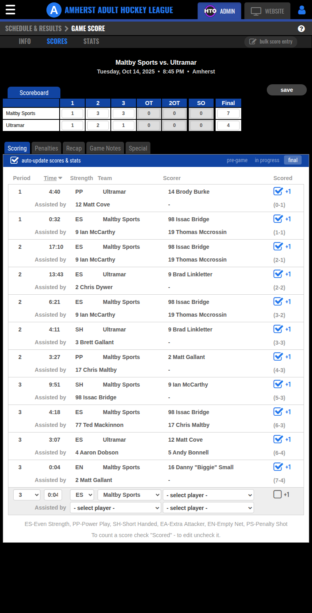

# Automated Scoresheet App — Feasibility Findings

**Date:** 2026-06-21
**Goal:** Replace paper scoresheets with a live app the timekeeper uses to enter
goals/penalties on the fly, eliminating lost/forgotten/illegible sheets.

**Verdict: Feasible, and easier than expected.** HomeTeamsOnline (the platform
behind the AAHL site) already *is* a digital scoresheet system. Live game scoring
exists today, and the score-entry form is a plain POST endpoint with no CSRF
token — so a custom front-end can push directly into it.

> Note: this investigation was **read-only**. No scores were submitted or modified
> on any live game while mapping the form.

---



## How scoring works in HomeTeamsOnline today

- Admin login: `https://www.hometeamsonline.com/sportswebsites/default.asp?p=login`
  (league account `amherstadulthockeyleague@gmail.com`, stored in `.env`).
  After login you land on `https://www.hometeamsonline.com/admin/`.
- **Schedule & Results** (`/admin/default.asp?p=schedule`) lists every game with
  `scores` / `stats` buttons per game, plus a **bulk score entry** page
  (`p=bulkscoreentry&dateID=YYYYMMDD`) for entering final scores across a date.
- Each game's `scores` button opens the **Game Score editor**:
  `GET/POST /admin/default.asp?p=ScoresEdit&a=1&sportsHQ=<DIV>&gameID=<ID>&gameID2=<ID2>`
  - `sportsHQ` = a team/division id (e.g. `TYLERARSENEAU-2`, `983723`).
  - `gameID` + `gameID2` = the two per-division copies of the same game
    (each game shows under both teams' schedules; both ids travel together).
- The editor is a full digital scoresheet:
  - Period-by-period line score (1/2/3/OT/2OT/PK/Final) for home & away.
  - **Scoring** list: each goal as Period • Time • Strength • Team • Scorer •
    Assist1 • Assist2, with running score.
  - **Penalties** list: Period • Time • Team • Player • Served-by • Infraction •
    Severity • Length.
  - An **"in progress"** toggle — i.e. the platform already supports live/partial
    games, not just final results.
- The public box score the scraper already reads (`scoring_summary`, `penalties`)
  is generated from exactly this data. So: enter here → public site updates →
  existing scraper + Yodeck display update with **no extra work**.

## The score-entry form (`form1` / `#scoreForm`, method POST, no CSRF token)

Action = the same `ScoresEdit` URL. Gated only by the ASP session cookie
(`ASPSESSIONID...`, HttpOnly) — there are **no hidden token/nonce fields**, which
makes server-side automation straightforward.

| Purpose | Fields |
|---|---|
| Away line score | `onea twoa threea ota twoota pka finala` |
| Home line score | `oneh twoh threeh oth twooth pkh finalh` |
| Add a goal | `scorePeriod` (1/2/3/OT/2OT/SO), `scoreTime` (mm:ss), `scoreStrength` (ES/PP/SH/EN/EA/PS), `scoreTeam` (=division id), `scorer` + 2 assist selects (values = player ids) |
| Add a penalty | `penaltyPeriod`, `penaltyTime`, `penaltyTeam`, `penaltyPlayer`, `servedPlayer`, `infraction` (e.g. `boarding`, `benchMinor`), `severity` (Minor/Major), `penaltyLength` (0/1.5/2/3/4/5/10) |
| Game state | `inProgress` (checkbox), `forfeit`, `scoresLock`, `aStandPtsMod`, `hStandPtsMod` |
| Submit | `save` |

- **Player dropdown values are stable numeric HomeTeamsOnline person ids**
  (e.g. `698268`=Matt Gallant, `371257`=Danny Small, `309464`=Luke Crocker).
  Options are rendered as `"<jersey#> <Name>"`. These ids are the join key our
  app would POST.
- Events appear to be appended **one at a time** (fill the blank goal/penalty row
  → `save` → reload shows it in the list). Edit/delete of existing rows happens via
  the editor's per-row controls (`EditorToggleClick('gamesum'|'playbyplay')`).
  *(Exact single-vs-batch submit semantics still to be confirmed with one careful
  test POST against a throwaway/preseason game.)*

## ✅ VALIDATED LIVE (2026-06-21) — the real save API

I created a throwaway Exhibition game (Ultramar @ Maltby, Springhill, deleted after),
entered a goal + penalty, confirmed persistence, then deleted it. The score editor's
save is **not** the old full-page form — it's a clean AJAX endpoint:

```
POST https://www.hometeamsonline.com/admin/ajax/scoresedit.asp
Content-Type: application/x-www-form-urlencoded; charset=UTF-8
(X-Requested-With: XMLHttpRequest)
Cookie: ASPSESSIONID… (from league login; HttpOnly; NO CSRF token)

# Goals:
action=updateScoreSummary
scoreSummaryData=[{"period":"1","scoreTime":"5:00","strength":"ES",
  "scoreTeam":"TYLERARSENEAU-1","scorer":"698268","assists1":"309464",
  "assists2":"","scoreTotalText":"(0-1)"}]
gameID=3329078
username=TYLERARSENEAU-1        # = home division id (same as sportsHQ)

# Penalties (same endpoint):
action=updatePenaltySummary
penaltySummaryData=[{"period":"1","penaltyTime":"10:00",
  "penaltyTeam":"TYLERARSENEAU-1","penaltyPlayer":"698268","servedPlayer":"",
  "infraction":"tripping","severity":"Minor","penaltyLength":"2"}]
gameID=3329078
username=TYLERARSENEAU-1
```

**Confirmed facts:**
- Auth is just the login session cookie — **no CSRF/nonce token**. A server-side
  client can log in once and POST directly. Verified with a raw `fetch()` from the
  page (status 200, `{"success":1,…}`).
- **`scoreSummaryData` / `penaltySummaryData` are the FULL authoritative arrays —
  REPLACE semantics, not append.** POSTing `[]` clears all goals/penalties. The
  server recomputes the period scoreboard and per-player stats (G/A/PIM/GWG/…) from
  the array and returns them in the response.
- **This dissolves the idempotency problem.** The app holds the complete event list
  locally and re-POSTs the whole array on every sync; retries are inherently safe.
  No event-level dedupe, no double-count risk. Offline-first becomes trivial:
  *local list is truth-in-flight → push entire array when online → server is truth-
  at-rest.*
- One game is keyed by the **home** `gameID` + matching `username` (division id).
  The `gameID2` is the away-team copy; the single API call updates the shared game,
  so both team views reflect it. (For the AAHL the home gameID is the one to use.)
- Player ids in `scorer`/`assists*`/`penaltyPlayer` = the same numeric person ids
  exposed in the roster dropdowns (e.g. `698268` Matt Gallant). The existing scraper
  already collects rosters, so the app can map jersey/name → id offline.

**Game lifecycle endpoints (for completeness — admins, not the timekeeper app):**
- Add game: dialog `InitDialog_For_AddGame()` → POST `?p=schedule`
  (teams `lgteamAway`/`lgteamHome` as division ids, `gamedateDate`, `gamedateTime`,
  `locationID`, game type, season, periods).
- Delete game: `ConfirmDelete({gameID, username, season, gametype})`.
- Per-player box-score stats also have `?p=StatsEdit` / `?p=StatsGoalieEdit`, but the
  scoring/penalty API above already auto-derives skater stats, so the app likely
  doesn't need StatsEdit.

## Additional endpoints validated for the proxy (2026-06-21)
- **Login:** `POST /sportswebsites/ajax/Login.asp?p=login&username=DSMALL` with body
  `username=<email>&password=<pw>` → sets the ASP session cookie. The hidden JS
  token fields on the login page are NOT required (verified: a plain fetch login
  authenticated a fresh session). **Logout:** `GET /admin/ajax/LogOut.asp`.
- **Game list:** the `?p=schedule` page is client-rendered; games come from
  `POST /admin/ajax/Schedule.asp?p=schedule` body `action=getDetailsHTML` → HTML
  table whose per-row `ScoreClick('…ScoresEdit…sportsHQ=<homeDiv>&gameID=<id>&gameID2=<id2>', <startMs>)`
  yields home div + game ids + start time; team names/location parse from the row.
- **Rosters + infractions:** the ScoresEdit page embeds `globalVars.playersByUsername`
  ({div:[{playerID,playernumber,firstName,lastName}]}) and `globalVars.infractionList`
  ({code:{label,severity}}) — both clean JSON the proxy regex-extracts.
- **Game status (pre/inProgress/final)** is NOT an ajax action — it toggles the
  `#inProgress` checkbox and submits the full score form (and `pre` clears scores).
  Deliberately left out of the prototype.

## ✅ Prototype built + end-to-end validated (2026-06-21)
See `scoresheet/` — a Cloudflare Worker proxy (`worker/`) + offline-first PWA (`web/`).
Capstone test against the live site: created a throwaway Exhibition game, discovered
it through the Worker's `Schedule.asp` path, pushed 2 goals + 1 penalty via the exact
Worker sync logic (server returned `success:1` and the correct per-period scoreboard),
then deleted the game. All parsers verified against real HTML (83 games parsed; rosters
14+14; 43 infractions; finals 4-7).

## Current teams / division ids (Winter 2025/2026)

| Team | division id (`sportsHQ` / `div`) |
|---|---|
| Maltby Sports | `TYLERARSENEAU-1` |
| Ultramar | `TYLERARSENEAU-2` |
| Colson Overhead Doors | `TYLERARSENEAU-3` |
| J&K Electric | `TYLERARSENEAU-4` |
| G.R. Mitchell Welding | `983723` |

---

## Architecture options

### Option A — Thin front-end over the official system *(recommended)*
A clean tablet/phone PWA the timekeeper opens at the rink (big Goal / Assist /
Penalty buttons, roster pre-loaded). A small server-side proxy holds the league
login and POSTs each event into `ScoresEdit`.
- **Pros:** Single source of truth stays HomeTeamsOnline; the public site,
  scraper, Yodeck display, stats and story packs all keep working unchanged. No
  data migration. Smallest build.
- **Cons:** Depends on an undocumented endpoint that could change; must manage the
  dual `gameID`/`gameID2` post, session lifetime, and append/edit semantics.

### Option B — Standalone app with our own DB, sync to HTO
Timekeeper enters into our own offline-first app (our DB = source of truth for the
live game); we push periodic/final sync into `ScoresEdit`.
- **Pros:** Full control of UX; robust offline; not at the mercy of HTO form
  changes during a game.
- **Cons:** Two sources of truth to reconcile; more to build.

### Option C — Use the existing admin page on a tablet *(zero-build stopgap)*
The league can already live-score today via `ScoresEdit` (it has the in-progress
flag). UX is clunky (ASP reloads, small controls, full admin login), but it proves
the workflow with the people doing timekeeping while A/B is built.

**Recommendation:** Build **A** as an offline-tolerant PWA with a thin auth proxy.
It kills the paper problem and keeps one source of truth that everything downstream
already consumes.

**DECISION (2026-06-21):** Going with **Option A, built offline-first.**

### Offline-first design (A done right — survives bad rink internet)
The "thin" app is **not** online-only. The timekeeper's device is the durable
buffer; HTO stays the single source of truth.

- Every event (goal/penalty) is written immediately to a **local outbox**
  (IndexedDB) with a client-generated id. The UI never blocks on the network, so
  scoring continues with zero signal.
- A background sync worker drains the outbox → auth proxy → HTO `ScoresEdit`
  whenever connectivity is available (live during the game if WiFi holds, or in one
  batch at game end / when signal returns).
- The local store is an **ephemeral buffer, not a competing database** — entries
  are cleared once confirmed in HTO. This keeps single-source-of-truth (unlike
  Option B's reconcile problem) *and* gets full offline resilience.
- Because each event carries period + time, **replaying the queue in order
  reconstructs the game faithfully** regardless of when it syncs; line-score totals
  are set explicitly at the end.
- **Idempotency is the main engineering nuance:** HTO has no idempotency key, so on
  retry we must not double-post. Approach: post event → re-fetch the game's scoring
  list → match & mark confirmed → only then drop from outbox. The dual
  `gameID`/`gameID2` post must also be handled atomically.
- Worst case (HTO unreachable all game): the timekeeper still finishes with a
  complete local scoresheet we can render/export (PDF) as a backup and sync later —
  so "lost sheet" is solved even with no internet at all.

## Open questions
1. ~~Exact POST payload~~ — **RESOLVED** (see validated API above).
2. ~~How events are edited/deleted~~ — **RESOLVED**: re-POST the full array
   (replace semantics); delete = omit the row / send `[]`.
3. ~~Roster player ids map to option values~~ — **RESOLVED**: same numeric person ids.
4. Session/login stability for an unattended proxy, and whether humans can share the
   same login concurrently (one league account). Need to test session lifetime and
   add re-login-on-401 handling in the proxy.
5. Rink network reliability (Amherst / Springhill) → confirmed design driver:
   offline-first capture + full-array background sync (already the plan).
6. Confirm goalie stats handling if the league wants per-goalie GA/SV (separate
   `StatsGoalieEdit`); skater stats are auto-derived so likely not needed.

## Suggested build (Option A, offline-first)
- **PWA** (installable, works offline): team/roster picker → live game screen with
  big Goal / Penalty buttons; each tap appends to a local event list (IndexedDB).
  Roster + player-id map cached from the existing scraper data.
- **Thin auth proxy** (small server, e.g. Cloudflare Worker / tiny Node service):
  holds the league login, maintains the ASP session, exposes
  `POST /game/:gameId/sync` that forwards `{scoreSummary, penaltySummary}` as the
  full-array calls above. Re-login on session expiry. Never ship the league
  password to the device.
- **Sync:** debounced full-array push while online; queue + retry while offline;
  end-of-game "final push." Because pushes are idempotent replaces, retries are safe.
- **Backup:** local PDF/CSV export of the scoresheet so a game is never lost even
  with zero connectivity.
